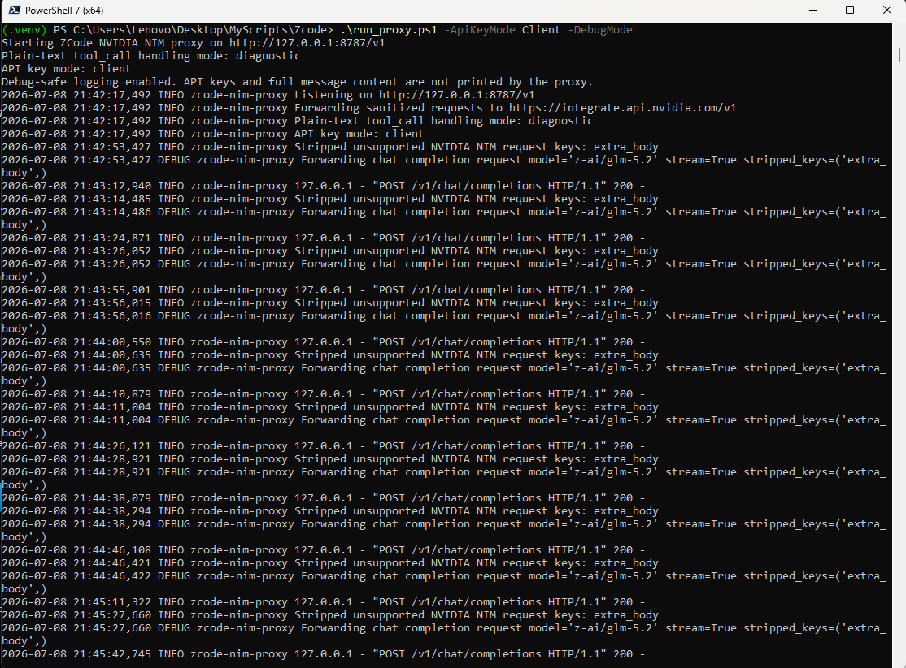
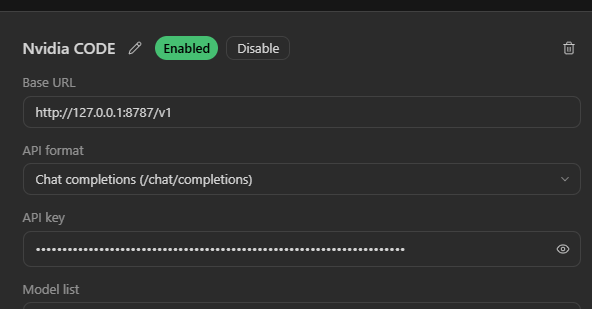

# zcode-nvidia-nim-fix

Windows-friendly local compatibility proxy for using NVIDIA NIM OpenAI-compatible chat models inside ZCode.

This project fixes the ZCode + NVIDIA NIM request failure:

```text
Validation: Unsupported parameter(s): `extra_body`
```

ZCode can send provider-extension fields such as `extra_body`. NVIDIA NIM rejects those fields at the top level of `/chat/completions` requests. This proxy runs locally, removes unsupported fields, and forwards a clean OpenAI-compatible request to NVIDIA NIM.

No NVIDIA API keys are stored in this repository. Do not commit real keys, `.env` files, screenshots with visible keys, or private provider names.

## What This Proxy Does

- Listens locally at `http://127.0.0.1:8787/v1`.
- Accepts OpenAI-compatible `POST /v1/chat/completions` requests from ZCode.
- Forwards requests to `https://integrate.api.nvidia.com/v1/chat/completions`.
- Removes NVIDIA-unsupported top-level fields such as `extra_body`.
- Preserves standard OpenAI-compatible fields such as `model`, `messages`, `stream`, `tools`, and `tool_choice`.
- Supports one API key through `NVIDIA_API_KEY` or multiple keys through ZCode provider API key fields.
- Does not print API keys or full message content.

## Screenshot

The proxy running in `Client` API key mode with debug-safe logging:



ZCode custom provider configuration using the local proxy URL:



## Requirements

- Windows 10/11
- PowerShell 5.1 or PowerShell 7+
- Python 3.10 or newer
- One or more NVIDIA API keys from NVIDIA NIM
- ZCode custom provider access

Check Python:

```powershell
python --version
```

## Step 1: Open The Repository

Open PowerShell in the repository folder:

```powershell
cd C:\Path\To\zcode-nvidia-nim-fix
```

## Step 2: Create The Virtual Environment

Run once:

```powershell
python -m venv .venv
```

If PowerShell blocks script activation, run this for the current user:

```powershell
Set-ExecutionPolicy -Scope CurrentUser RemoteSigned
```

Activate the virtual environment:

```powershell
.\.venv\Scripts\Activate.ps1
```

Upgrade pip:

```powershell
python -m pip install --upgrade pip
```

No third-party runtime package is required for the proxy itself. It uses Python standard library modules.

## Step 3: Choose API Key Mode

### Option A: One NVIDIA API Key

Use this when all ZCode providers should share one NVIDIA API key.

```powershell
$env:NVIDIA_API_KEY="YOUR_NVIDIA_API_KEY"
.\run_proxy.ps1 -DebugMode
```

In ZCode, the provider API key can be any placeholder because the proxy uses `NVIDIA_API_KEY`.

### Option B: Multiple NVIDIA API Keys

Use this when several ZCode providers should each use their own NVIDIA API key.

Start the proxy:

```powershell
.\run_proxy.ps1 -ApiKeyMode Client -DebugMode
```

Then configure every ZCode provider with the same local base URL and its own NVIDIA key:

| ZCode field | Value |
| --- | --- |
| Base URL | `http://127.0.0.1:8787/v1` |
| API format | `Chat completions (/chat/completions)` |
| API key | That provider's own NVIDIA API key |
| Model | Any NVIDIA NIM chat model ID available to your key |

Example six-provider layout:

| Provider | Base URL | API key field |
| --- | --- | --- |
| Nvidia CODE | `http://127.0.0.1:8787/v1` | NVIDIA key #1 |
| Nvidia BOT | `http://127.0.0.1:8787/v1` | NVIDIA key #2 |
| Nvidia EDU | `http://127.0.0.1:8787/v1` | NVIDIA key #3 |
| Nvidia K12 | `http://127.0.0.1:8787/v1` | NVIDIA key #4 |
| Nvidia Extra 1 | `http://127.0.0.1:8787/v1` | NVIDIA key #5 |
| Nvidia Extra 2 | `http://127.0.0.1:8787/v1` | NVIDIA key #6 |

In `Client` mode, the proxy forwards ZCode's incoming `Authorization: Bearer ...` token to NVIDIA NIM. The key is never printed.

## Step 4: Configure ZCode

For each custom provider:

1. Open ZCode provider settings.
2. Add or edit a custom provider.
3. Set Base URL:

   ```text
   http://127.0.0.1:8787/v1
   ```

4. Set API format:

   ```text
   Chat completions (/chat/completions)
   ```

5. Set API key:
   - In `Env` mode: any placeholder.
   - In `Client` mode: the real NVIDIA API key for that provider.
6. Add model IDs you want to use, for example:

   ```text
   z-ai/glm-5.2
   z-ai/glm-5.1
   moonshotai/kimi-k2.6
   deepseek-ai/deepseek-v4-pro
   qwen/qwen3-coder-480b-a35b-instruct
   nvidia/nemotron-3-ultra-550b-a55b
   ```

The proxy is not limited to GLM 5.2. It forwards the `model` value sent by ZCode. The selected model must be available through NVIDIA NIM and support `/chat/completions`.

## Step 5: Test The Proxy

Health check:

```powershell
Invoke-RestMethod http://127.0.0.1:8787/health
```

Manual chat completion test in `Env` mode:

```powershell
$env:NVIDIA_API_KEY="YOUR_NVIDIA_API_KEY"
.\run_proxy.ps1 -DebugMode
```

Open a second PowerShell window:

```powershell
$body = @{
  model = "z-ai/glm-5.2"
  messages = @(
    @{
      role = "user"
      content = "Say hello in one sentence."
    }
  )
  stream = $false
  max_tokens = 128
  extra_body = @{
    chat_template_kwargs = @{
      enable_thinking = $false
    }
  }
} | ConvertTo-Json -Depth 10

Invoke-RestMethod `
  -Method Post `
  -Uri "http://127.0.0.1:8787/v1/chat/completions" `
  -Headers @{ Authorization = "Bearer placeholder" } `
  -ContentType "application/json" `
  -Body $body
```

Expected proxy log:

```text
Stripped unsupported NVIDIA NIM request keys: extra_body
```

## Launcher Commands

Default one-key mode:

```powershell
$env:NVIDIA_API_KEY="YOUR_NVIDIA_API_KEY"
.\run_proxy.ps1
```

Default one-key mode with debug-safe logs:

```powershell
$env:NVIDIA_API_KEY="YOUR_NVIDIA_API_KEY"
.\run_proxy.ps1 -DebugMode
```

Multiple-key mode:

```powershell
.\run_proxy.ps1 -ApiKeyMode Client -DebugMode
```

Pass raw upstream tool-call-looking text instead of readable diagnostics:

```powershell
.\run_proxy.ps1 -ToolCallTextMode pass -DebugMode
```

Batch wrapper:

```bat
start_proxy.bat
start_proxy.bat -ApiKeyMode Client -DebugMode
```

## Request Sanitizer

For NVIDIA NIM requests, the proxy keeps these top-level fields:

- `model`
- `messages`
- `temperature`
- `top_p`
- `max_tokens`
- `stream`
- `seed`
- `stop`
- `frequency_penalty`
- `presence_penalty`
- `tools`
- `tool_choice`
- `parallel_tool_calls`

It removes unsupported or provider-specific top-level fields such as:

- `extra_body`
- `extraBody`
- `chat_template_kwargs`
- `enable_thinking`
- `reasoning_effort`
- unknown provider-extension fields

`tools`, `tool_choice`, and `parallel_tool_calls` are preserved because they are standard OpenAI-compatible tool-calling fields.

## GLM 5.2 Compatibility Note

NVIDIA's GLM 5.2 sample uses:

- `base_url = "https://integrate.api.nvidia.com/v1"`
- `model = "z-ai/glm-5.2"`
- `temperature = 1`
- `top_p = 1`
- `max_tokens = 16384`
- `seed = 42`
- `stream = true`

Those fields are preserved by the sanitizer. The NVIDIA sample does not use `extra_body`, which matches this project's fix.

## Tool-Call Diagnostic Behavior

Some NVIDIA NIM models may return text like this instead of real OpenAI-compatible `tool_calls` data:

```text
<tool_call>Read ...</tool_call>
```

The proxy does not execute or parse that text as a command. By default, it replaces the long raw markup with a readable diagnostic message. This keeps ZCode output understandable and avoids treating model-generated text as trusted tool execution.

If this happens, the request reached NVIDIA NIM, but the selected model or model profile may not support the structured tool-call format expected by ZCode.

## Troubleshooting HTTP 429

If the proxy log shows:

```text
"POST /v1/chat/completions HTTP/1.1" 429 -
```

that means the local proxy is running and NVIDIA NIM returned `429 Too Many Requests`. A successful model response would normally be `200`, but changing `429` to `200` in the proxy would hide the real upstream rate-limit or quota problem.

Common causes:

- The proxy is running in `env` mode and all ZCode providers are sharing one NVIDIA API key.
- Too many requests are sent to the same NVIDIA key.
- The selected NVIDIA model has a per-key quota or concurrency limit.
- ZCode is retrying quickly after failed requests.

Check the proxy startup log:

```text
API key mode: env
```

If you have multiple NVIDIA API keys, stop the proxy with `Ctrl+C` and restart it in client key mode:

```powershell
.\run_proxy.ps1 -ApiKeyMode Client -DebugMode
```

Then keep the same Base URL for all ZCode providers:

```text
http://127.0.0.1:8787/v1
```

Put a different NVIDIA API key in each provider's `API key` field. This spreads requests across your keys instead of sending every provider through one `NVIDIA_API_KEY` environment value.

## Development Checks

Install developer tools if needed:

```powershell
python -m pip install pytest ruff mypy
```

Run tests:

```powershell
python -m pytest
```

Run lint and type checks:

```powershell
python -m ruff check .
python -m mypy nvidia_nim_proxy tests
```

## Configuration Reference

| Variable | Default | Purpose |
| --- | --- | --- |
| `NVIDIA_API_KEY` | Required in `env` mode | NVIDIA NIM API key used for upstream requests |
| `NIM_PROXY_HOST` | `127.0.0.1` | Local bind host |
| `NIM_PROXY_PORT` | `8787` | Local bind port |
| `NIM_PROXY_UPSTREAM_BASE_URL` | `https://integrate.api.nvidia.com/v1` | OpenAI-compatible NVIDIA NIM base URL |
| `NIM_PROXY_TOOL_CALL_TEXT_MODE` | `diagnostic` | Use `diagnostic` for readable tool-call leak messages or `pass` for raw upstream output |
| `NIM_PROXY_API_KEY_MODE` | `env` | Use `env` for `NVIDIA_API_KEY` or `client` to forward each ZCode provider key |

## Security And Privacy

- Do not commit NVIDIA API keys.
- Do not commit `.env` files.
- Do not commit screenshots that show visible keys.
- `.venv/`, `.env`, `.env.*`, cache folders, and package build output are ignored by `.gitignore`.
- The proxy binds to `127.0.0.1` by default.
- Logs show stripped key names only, not secrets or full message content.
- In `Client` mode, incoming ZCode bearer tokens are forwarded to NVIDIA NIM but never printed.

Before publishing, check:

```powershell
git status --short
rg -n "nvapi-|NVIDIA_API_KEY=|Bearer " .
```

The search may find documentation placeholders such as `NVIDIA_API_KEY`; it should not find real keys.

## Roadmap

- Add integration tests with a mock upstream streaming server.
- Add optional allowlist extension by environment variable for future NVIDIA-supported fields.
- Add a Windows service wrapper for persistent local use.
- Add privacy-preserving request metrics without logging prompt content.

## Versioning

This project follows semantic versioning.

Current version: `0.1.0`.
